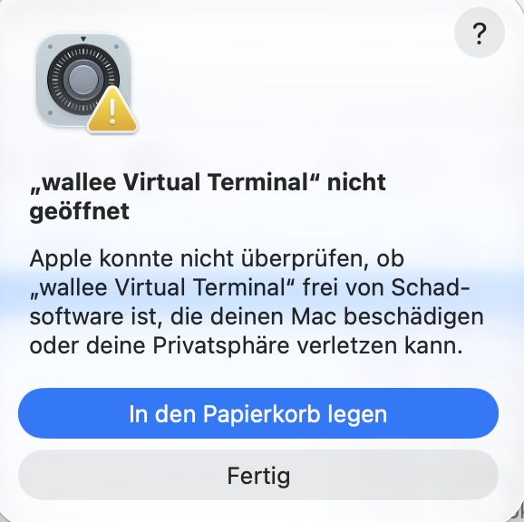

# Installation und erster Start

Schritt-für-Schritt-Anleitung für Mitarbeitende, die das wallee Virtual Terminal auf einem Computer
einrichten. Dauer: etwa fünf Minuten. Die Einrichtung der Verbindung zu wallee (Application User,
Space ID) ist im [README](README.md#einrichtung-in-wallee-einmalig) beschrieben.

**Das Wichtigste vorweg:** Beim ersten Start warnt macOS bzw. Windows vor dem Programm, weil es noch nicht
bei Apple bzw. Microsoft signiert ist. Das ist kein Hinweis auf Schadsoftware und muss **einmal pro Computer**
bestätigt werden. Die Schritte dazu stehen unten.

---

## macOS

### 1. Herunterladen

1. Öffnen Sie die Seite [Releases](https://github.com/saschakruesi/wallee-virtual-terminal/releases/latest).
2. Laden Sie unter «Assets» die Datei **`wallee-virtual-terminal-macos.zip`** herunter. Sie passt für
   Apple Silicon (M1 und neuer) und Intel.

### 2. Entpacken und ablegen

1. Doppelklick auf die Zip-Datei im Ordner «Downloads». Es erscheint **«wallee Virtual Terminal»**.
2. Ziehen Sie «wallee Virtual Terminal» in den Ordner **«Programme»** (Finder → Gehe zu → Programme).
   Die Zip-Datei können Sie danach löschen.

### 3. Erster Start: Warnung von Apple bestätigen

Beim ersten Doppelklick zeigt macOS diesen Dialog:



**Klicken Sie nicht auf «In den Papierkorb legen».** Wie es weitergeht, hängt von Ihrer macOS-Version ab
(Apple-Menü  → «Über diesen Mac» zeigt sie an).

#### macOS 15 (Sequoia) und neuer

1. Im Dialog auf **«Fertig»** klicken.
2. Apple-Menü  → **Systemeinstellungen** → links **«Datenschutz & Sicherheit»**.
3. Rechts ganz nach unten scrollen bis zum Abschnitt **«Sicherheit»**. Dort steht:
   «„wallee Virtual Terminal“ wurde blockiert, um deinen Mac zu schützen.»
4. Auf **«Trotzdem öffnen»** klicken.
5. Mit Ihrem Mac-Passwort oder Touch ID bestätigen.
6. Es erscheint noch einmal ein Dialog; dort auf **«Öffnen»** klicken.
7. Ihr Browser öffnet sich mit dem Programm unter `http://127.0.0.1:7811`. Fertig.

Der Eintrag unter «Sicherheit» erscheint nur, wenn der Startversuch aus Schritt 1 kurz vorher war
(innerhalb etwa einer Stunde). Fehlt er, wiederholen Sie einfach den Doppelklick auf das Programm und
gehen Sie dann erneut in die Systemeinstellungen.

Der Weg über Rechtsklick → «Öffnen» funktioniert seit macOS 15 **nicht mehr** für unsignierte Programme.

#### macOS 14 (Sonoma) und älter

1. Im Dialog auf «Fertig» bzw. «Abbrechen» klicken.
2. **Rechtsklick** (oder ctrl + Klick) auf «wallee Virtual Terminal» → **«Öffnen»**.
3. Im Dialog auf **«Öffnen»** klicken.
4. Ihr Browser öffnet sich mit dem Programm. Fertig.

Zeigt der Dialog keine Taste «Öffnen», gehen Sie den Weg über die Systemeinstellungen wie bei macOS 15.

#### Alternative für IT-Administratoren: Terminal

Wer das Programm auf mehrere Macs verteilt (z.B. per MDM oder Skript), kann die Quarantäne-Markierung des
Downloads entfernen. macOS prüft das Programm danach nicht mehr beim Start:

```bash
xattr -rd com.apple.quarantine "/Applications/wallee Virtual Terminal.app"
```

### 4. Danach

- Die Warnung erscheint pro Computer nur einmal. Spätere Updates über das Banner im Programm lösen sie in
  der Regel nicht erneut aus, weil das Programm die neue Version selbst lädt und nicht der Browser.
- Laden Sie die Zip-Datei irgendwann erneut aus dem Browser herunter, wiederholen Sie Schritt 3.
- Das Programm hat kein eigenes Fenster. Es läuft im Hintergrund, bis Sie es im Browser oben rechts über
  **«Beenden»** schliessen oder den Computer neu starten. Ein weiterer Doppelklick öffnet nur den Browser.

---

## Windows

### 1. Herunterladen

1. Öffnen Sie die Seite [Releases](https://github.com/saschakruesi/wallee-virtual-terminal/releases/latest).
2. Laden Sie unter «Assets» die Datei **`wallee-virtual-terminal-windows.exe`** herunter (64-bit).
3. Legen Sie die Datei an einen beliebigen Ort, z.B. auf den Desktop. Eine Installation ist nicht nötig.

### 2. Erster Start: SmartScreen bestätigen

1. Doppelklick auf die Datei. Windows zeigt «Der Computer wurde durch Windows geschützt».
2. Auf **«Weitere Informationen»** klicken.
3. Auf **«Trotzdem ausführen»** klicken.
4. Fragt die Windows-Firewall nach, bestätigen Sie mit «Zugriff zulassen». Das Programm braucht nur
   ausgehende Verbindungen zu `app-wallee.com`; auch ein «Abbrechen» verhindert die Nutzung nicht.
5. Ihr Browser öffnet sich mit dem Programm unter `http://127.0.0.1:7811`. Fertig.

Die SmartScreen-Meldung erscheint einmal pro heruntergeladener Datei.

---

## Häufige Probleme beim ersten Start

**Es öffnet sich kein Browser.** Öffnen Sie Ihren Browser von Hand und geben Sie `http://127.0.0.1:7811`
ein. Ist dieser Port belegt, weicht das Programm auf 7812, 7813 usw. aus.

**Das Programm ist weg, nachdem ich «In den Papierkorb legen» geklickt habe.** Holen Sie es aus dem
Papierkorb zurück (Rechtsklick → «Zurücklegen») oder laden Sie die Zip-Datei erneut herunter, und folgen
Sie Schritt 3.

**Sie hatten schon Version 1.2.0 oder älter auf dem Mac?** Diese Versionen bestanden aus einer einzelnen
Datei und können sich nicht selbst auf das neue Format aktualisieren; sie zeigen auch kein Update-Banner.
Laden Sie einmalig die Zip-Datei herunter (Schritte 1 bis 3) und löschen Sie die alte Datei.

---

## Dauerhaft ohne Warnung: Signierung (Aufgabe für wallee)

Die Warnungen verschwinden für alle Kundinnen und Kunden, sobald die Releases signiert sind:

- **macOS:** Apple-Developer-Programm, Zertifikat «Developer ID Application» und Notarisierung. Der
  Release-Workflow ist dafür vorbereitet und signiert automatisch, sobald die Apple-Secrets im Repository
  hinterlegt sind.
- **Windows:** Code-Signing-Zertifikat; SmartScreen verschwindet mit der Zeit, sobald das Zertifikat
  Reputation aufgebaut hat.

Was genau zu beschaffen und wo es zu hinterlegen ist, steht in
[docs/01-architektur.md → Signaturen](docs/01-architektur.md#signaturen-offener-punkt-für-wallee).
